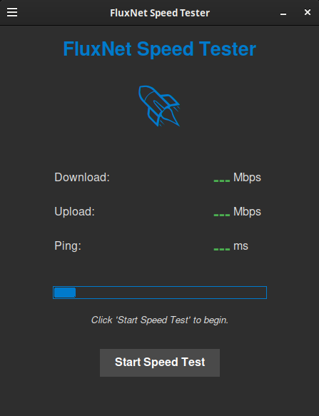

# FluxNet Speed Tester 🚀


*(Replace this with an actual screenshot of your app! A GIF showing the real-time update would be even better.)*

A pretty desktop application built with Python and Tkinter to test your internet download speed, upload speed, and ping. It features a modern dark theme and real-time speed updates during testing.

## Features

*   **Download Speed Test:** Measures your current download bandwidth.
*   **Upload Speed Test:** Measures your current upload bandwidth.
*   **Ping Test:** Measures the latency to the test server.
*   **Real-time Updates:** See your download and upload speeds update live during the test.
*   **Clean & Modern GUI:** User-friendly interface with a dark theme, built using Tkinter.
*   **Responsive UI:** The application remains responsive during tests thanks to threading.
*   **Status Messages:** Clear feedback on the test progress and any errors.
*   **Cross-Platform:** Should work on Windows, macOS, and Linux where Python and Tkinter are available.

## Technologies Used

*   **Python 3**
*   **Tkinter:** For the graphical user interface.
*   **`speedtest-cli`:** The underlying library used to perform the actual internet speed measurements.
*   **Threading:** To keep the GUI responsive during network operations.

## Prerequisites

*   **Python 3.7+**
*   **pip** (Python package installer)
*   An active internet connection (of course!)

## Installation

1.  **Clone the repository:**
    ```bash
    git clone https://github.com/azario0/FluxNet.git
    cd FluxNet
    ```

2.  **Install the required Python package:**
    ```bash
    pip install speedtest-cli
    ```
    *(Alternatively, if you create a `requirements.txt` file containing `speedtest-cli`, users can run `pip install -r requirements.txt`)*

## Usage

Navigate to the project directory in your terminal and run the application:

```bash
python app.py
```

Click the "Start Speed Test" button to begin. The application will:

    Find the best server.

    Test download speed (updating the display in real-time).

    Test upload speed (updating the display in real-time).

    Display the final results for download, upload, and ping.

To-Do / Potential Future Enhancements

    Allow user to select a test server.

    Store and display a history of previous speed tests.

    Option to export test results (e.g., to CSV).

    Add more theme options or theme customization.

    Package the application into a standalone executable (e.g., using PyInstaller or cx_Freeze).

    Add a settings panel for units (Mbps, MB/s, kbps, kB/s).

    More detailed progress indication if possible.

Contributing

Contributions are welcome! If you have suggestions for improvements or want to fix a bug:

    Fork the Project

    Create your Feature Branch (git checkout -b feature/AmazingFeature)

    Commit your Changes (git commit -m 'Add some AmazingFeature')

    Push to the Branch (git push origin feature/AmazingFeature)

    Open a Pull Request

Please make sure to update tests as appropriate.
License

Distributed under the MIT License. See LICENSE file for more information.

Acknowledgements

    This project relies heavily on the speedtest-cli library by Matt Martz.

    Python and the Tkinter library.

Happy Speed Testing! 🎉